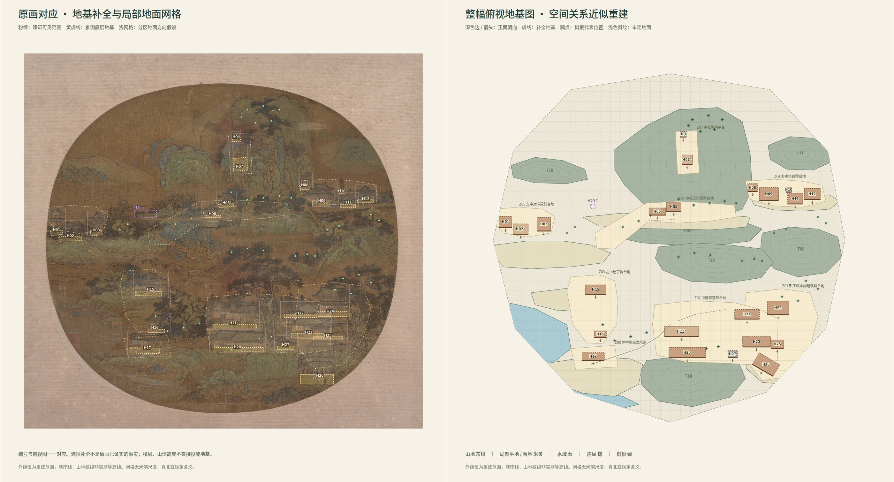

# Ancient Painting to Plan · 古画空间布局重建

从山水画里的房屋、树木、山地、水域和平地，整理可追溯的**相对地面布局**。
本仓库收录两条研究路线：先重建简化 3D 再俯视，以及直接推断地基与 2D 俯视布局。

这是实验性研究代码，不是测绘工具或经过独立标注集验证的自动识别产品。
输出包含遮挡补全、朝向和尺度假设；“测试通过”不代表画中所有对象都识别正确。



## 两种方法是什么

| | A · 简化 3D 重建 `cuboid3d` | B · 地基俯视重建 `foundation2d` |
|---|---|---|
| 目的 | 房屋体块、正交俯视图、GLB | 原画对应标注与完整的相对地基图 |
| 主流程 | 房屋定位 → 独立朝向判断 → 长宽推断 → 长方体 → 俯视 | 全图/分块巡查 → 地面分类 → 遮挡与身份复核 → 地基布局 → 几何检查 |
| 模型路线 | 历史 Qwen3-VL 8B/32B、YOLO、SAM 2.1、分类器 | 云端 Qwen 3.8 多模态；本地仅 CPU |
| 关键先验 | 示例的相机、山水树轮廓明确保存在 JSON；不是自动估计 | 模型假设局部地面方向、地基和相对位置；没有米制标定 |
| 朝向含义 | 沿房屋长轴，指向可见短端墙 | 指向正面的法向；**不可直接混用两种角度** |
| 无模型复现 | 3 个小场景的缓存回放 | 1 幅大画的审阅后 JSON 回放 |
| 新图能力边界 | 需要另备检测权重/缓存、朝向结果、场景先验 | 可调用云端处理新图，但需分阶段审阅；非无限自动优化 |

两组示例不是同一测试集，不能用它们给两种方法作准确率排名。
如果只需要俯视图，B 避免了不必要的 3D 高度拟合；A 保留了体块和渲染研究接口。

## 先看结果

- A：[三场景对照](examples/cuboid3d/preview/all_scenes_comparison.png)、[第一场景俯视](examples/cuboid3d/preview/scene_01_compound/top_view.png)、[GLB](examples/cuboid3d/preview/scene_01_compound/scene.glb)。缓存实例数为 4 / 2 / 2。
- B：[完整对照](examples/foundation2d/preview/overview.png)、[俯视图](examples/foundation2d/preview/topview.png)、[交互页面](examples/foundation2d/preview/index.html)、[H14 身份修订案例](examples/foundation2d/H14_comparison.png)。HTML 下载后本地打开；GitHub 文件页不直接执行 HTML。
- B 当前有 **23 个占地区域**：20 个 `house` 区域、3 个 `other` 区域。其中 H02/H07/H21 是未拆清的组团，不等于精确栋数；H29 只显示未定候选，不生成地基。H13/H14 已分别按栏墙结构/倒影排除。

## 五分钟离线复现

以下步骤不需要 API Key，不安装 PyTorch，不下载模型，不使用 GPU。安装依赖需要网络；回放本身不联网。
推荐 Linux + Python 3.12；CI 同时检查 Python 3.11。

```bash
git clone https://github.com/Cyano-Tech/ancient-painting-to-plan.git
cd ancient-painting-to-plan
python3.12 -m venv .venv
source .venv/bin/activate
python -m pip install --require-hashes -r requirements.lock
python -m pip install --no-deps -e .
python scripts/replay_examples.py all --output artifacts/demo
python -m pytest -q
```

PNG 需要系统 Cairo 库和中文字体；Ubuntu/Debian 可安装 `libcairo2 fonts-noto-cjk`。
如暂不需要 PNG，可只安装 `python -m pip install -e .`，运行
`python scripts/replay_examples.py all --svg-only --output artifacts/demo-svg`。
测试里的 PNG 检查仍需要 `render` 依赖。

打开 `artifacts/demo/foundation2d/index.html`，或查看 `artifacts/demo/cuboid3d/all_scenes_comparison.png`。
输出目录必须为空；再次运行请换新目录，程序不会自动清空文件。

## 新图与完整文档

- [A：缓存、尺寸推断、3D 与本地推理边界](docs/METHOD_CUBOID3D.md)
- [B：云端配置、分阶段运行与遮挡复核](docs/METHOD_FOUNDATION2D.md)
- [数据结构与坐标约定](docs/DATA_CONTRACTS.md)
- [复现、测试范围与已知限制](docs/REPRODUCIBILITY.md)
- [素材和依赖来源](docs/ATTRIBUTION.md) · [安全说明](SECURITY.md) · [贡献约定](CONTRIBUTING.md)
- [项目介绍文章 / Post](docs/POST.zh-CN.md)

```text
src/ancientplan/
  cuboid3d/           体块推断、GLB、缓存校验、可选历史推理脚本
  foundation2d/      云端请求、schema、身份/形状复核、布局、SVG/HTML
examples/            输入、脱敏缓存、可复现计划、精选结果
tests/               离线单元测试、反例和固定案例回归
scripts/             回放、发布检查工具
docs/                方法、数据、复现、来源和项目介绍
```

## 许可与发布范围

初始版本按私有研究仓库整理，未擅自选择开源许可证。代码授权待权利人决定，见 [LICENSE.md](LICENSE.md)。
旧示例裁片的原始图像出处尚未完整核实，转为公开仓库前必须解决；新示例附大都会博物馆来源。
仓库不含 API 密钥、业务空间专属地址、模型权重、完整训练集或私有运行日志。

## English summary

Two experimental, auditable routes from historical landscape paintings to **relative ground layouts**:
(A) cached building detection and a separate long-axis orientation pass, followed by coarse cuboids and GLB export;
(B) cloud multimodal scene analysis, occlusion/identity review, foundation hypotheses and a direct 2D plan.
Both curated examples replay entirely on CPU without credentials. The 3D examples use explicit manual camera/terrain priors;
the 2D example is not a metric survey, and uncertain groups are not exact building counts.
The two routes use different example images and do not constitute a head-to-head benchmark.
See the method guides and reproduction limits before making accuracy or licensing claims.
