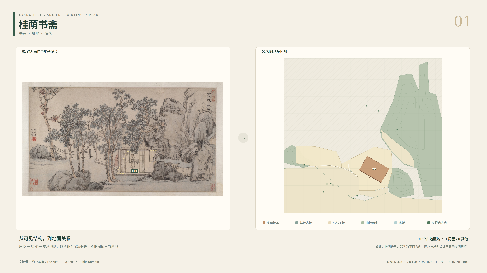

# 从古画里的房子，到可检查的地基俯视图

山水画的空间并不总能用一个相机解释。建筑常被树、墙、山体挡住，画面上相近的两个屋顶，
可能是两栋房屋，也可能是同一组建筑的一部分。把屋顶框出来，再按框的宽高画成平面矩形，往往会错得很有“完成度”。

这个项目保留了两条探索路线，让每个结果都能回到原图和证据，而不是只留一张看似完整的示意图。

## 路线 A：先有体块，再看俯视

第一条路线把房屋简化为长方体：先用模型找整栋建筑，再单独判断长轴朝向和短端墙，
结合可见墙脚/分割轮廓估计长宽，最后生成原视角渲染、GLB 和正交俯视图。

3D 历史对照保留在 [v0.1.0 归档](https://github.com/Cyano-Tech/ancient-painting-to-plan/tree/v0.1.0/examples/cuboid3d)；当前展示目录只呈现 2D。

它适合研究“二维证据如何约束三维体块”，但当前实现依赖明确给定的相机和地形先验。
语义对照中的一致性只是对同一几何渲染的检查，不能当作对古画的精确还原。

## 路线 B：直接围绕地基组织证据

如果最终只要俯视图，另一条路线更直接：先找地面相关元素，再区分可见部分、遮挡补全和未定区域，
最后组织成可检查的相对平面。山顶平台也可以是平地，因为关注的是建筑立在哪里，不是绝对海拔。

新的 [十张 4K 对照图](EXAMPLES_2D.md) 使用十幅不同画作，覆盖书斋、江村、亭阁、山寺与雪景。

全图负责空间关系，重叠分块找小对象，独立局部复核处理身份与尺寸。布局优化器只能在有限范围移动地基中心，
不能为了去掉碰撞而随意压缩房子、修改原画坐标或删除难处理的对象。

## 一次值得保留的失败：把倒影当成房屋

H14 曾被当作左侧建筑。放大上下文后，屋顶在墙体下方等线索支持其为倒影，因而不应再有独立地基。
修订保留了原先判断与新证据的区别，并用通用的实体/反射、屋顶—墙—地面连续性规则处理这类错误。
这不是在推理代码里写一个“如果 ID 等于 H14 就删除”的特例。

[H14 历史修订图](https://github.com/Cyano-Tech/ancient-painting-to-plan/blob/v0.1.0/examples/foundation2d/H14_comparison.png)

这一旧回归快照输出 23 个占地区域，其中一些仍是未拆清组团；另一个候选只保留问号。
倒影判断改正了，不代表整幅画的水岸边界、所有遮挡或所有房屋就都准确了。

## 这次发布包含什么

两套代码、提示词、数据契约、脱敏示例、离线回放、失败案例和自动化测试。
不需要 GPU 或 API Key 就能回放历史夹具；十张新展示 PNG 的推理使用云端，重新推理需要自己的账号和分阶段审阅。
旧本地推理源码也保留，但自训练权重和完整数据集不随包分发。

我们希望结果既能看，也能追问：这个范围是观察到的，还是推测的？这个角度指哪一面？这个测试能证明什么？
因此本版本称为研究布局假设，而不是自动测绘或古画空间的唯一正确答案。

项目入口：[README](../README.md)。图像来源、私有发布范围和待确认许可见 [来源说明](ATTRIBUTION.md)。
